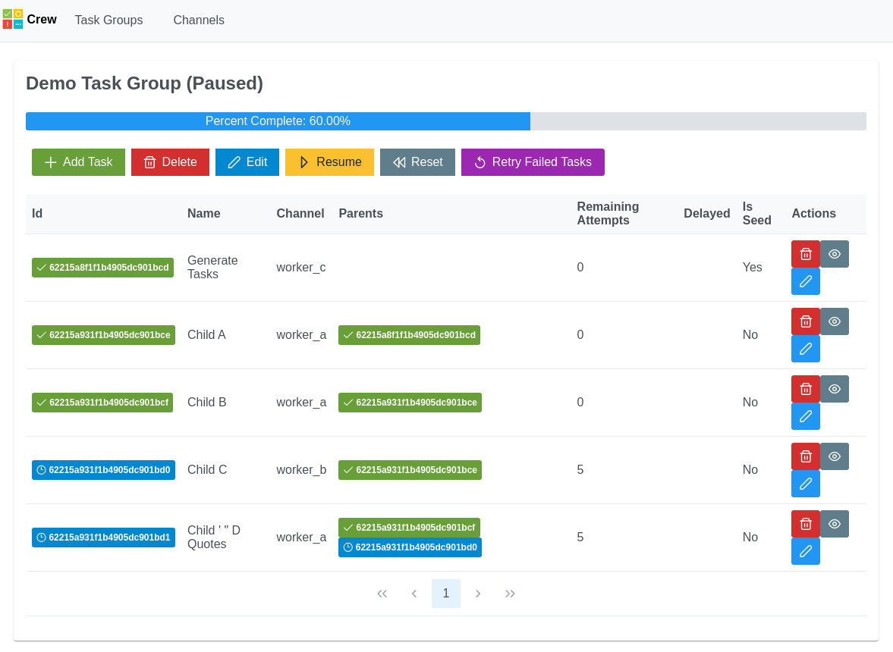

# Crew UI

This is a VueJS based UI for [Crew](https://github.com/orchard-insights/crew).



## Usage

Install globally:

```
npm install --global @orchard-insights/crew-ui
```

Then run the UI server with:

```
crew-ui serve
```

To specify the address of the Crew API:

```
crew-ui serve --url http://localhost:3000/
```

## Development

Vue and Vite:

```
yarn install
yarn dev
```

Or for the cli:

```
yarn build
yarn cli serve
```

## Environment variables

Use these environment variables to point the UI at a running instance of crew.  *http://localhost:3000/* is the default.

```
VITE_CREW_API_BASE_URL=http://localhost:3000/
VITE_CREW_API_WS_URL=http://localhost:3000/
```